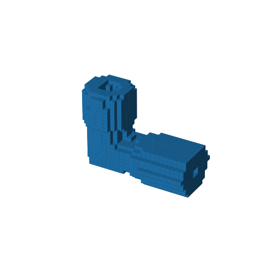
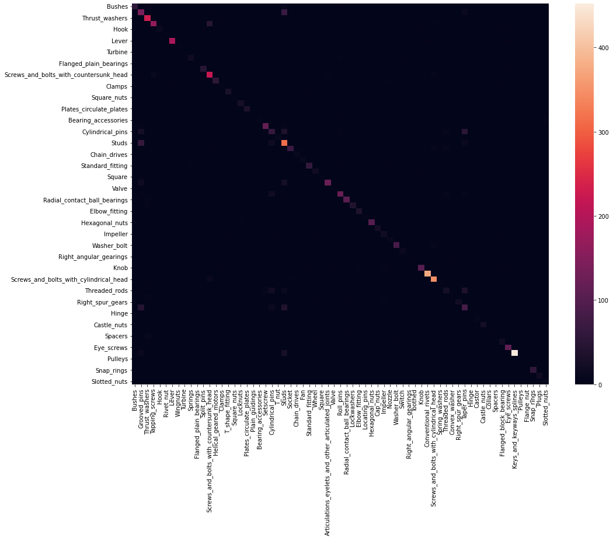
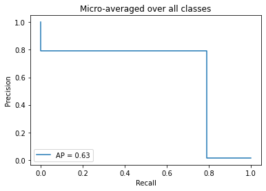

```python
import os
import glob
import numpy as np
import trimesh
import binvox_rw
from sklearn.utils import shuffle
import tensorflow as tf
from tensorflow.keras.layers import Conv3D, Dense, Flatten, Reshape,MaxPool3D,GlobalAveragePooling3D,BatchNormalization,Dropout,LeakyReLU
from tensorflow.keras.models import Sequential
from sklearn.metrics import confusion_matrix
from sklearn.metrics import classification_report
import matplotlib.pyplot as plt
from keras.callbacks import EarlyStopping,Callback,ModelCheckpoint
from time import time
import itertools
import seaborn as sns
import pandas as pd
from pretty_confusion_matrix import pp_matrix_from_data
```


```python
path = r'/ocean/projects/mch210006p/mhrahman/Main'
folders = glob.glob(os.path.join(path,'*'))
Classes = []
for i in folders:
    cls = os.path.basename(i)
    Classes.append(cls)
```


```python
with open(os.path.join(path,'Elbow_fitting/train/00021151.binvox'),'rb') as vox:
    data = np.int32(binvox_rw.read_as_3d_array(vox).data)
    padded_data = np.pad(data,3, 'constant')
ax = plt.figure(figsize=(15,10)).add_subplot(111,projection='3d')
ax.voxels(padded_data)
ax.set_axis_off()
plt.savefig('/jet/home/mhrahman/Projects/Project/Voxnet/Figures/Voxel.jpg',dpi = 300)
plt.show()
```


    

    


```python
length = []
for i, folder in enumerate(folders):
    train_files = glob.glob(os.path.join(folder,"train/*obj"))
    val_files = glob.glob(os.path.join(folder,"val/*obj"))
    test_files = glob.glob(os.path.join(folder,"test/*obj"))
    a = len(train_files) + len(val_files) + len(test_files)
    length.append(a)
```


```python
data_count = pd.DataFrame({'Name': Classes, "Count":length})
data_count.to_csv('Data_count',index= False)
```


```python
np.sum(length)
```


    51638


```python
X = {'train':[],'val': [],'test':[]}
Y = {'train':[],'val':[],'test':[]}
for label,cl in enumerate(Classes):
    for split in ['train','val','test']:
        example_dir = os.path.join(path,cl,split)
        for example in os.listdir(example_dir):
            if 'binvox' in example:
                with open(os.path.join(example_dir,example),'rb') as file:
                    data = np.int32(binvox_rw.read_as_3d_array(file).data)
                    padded_data = np.pad(data,3, 'constant')
                    X[split].append(padded_data)
                    Y[split].append(label)
```


```python
X_train, Y_train = shuffle(X['train'],Y['train'])
X_test, Y_test = shuffle(X['test'],Y['test'])
X_val, Y_val = shuffle(X['val'],Y['val'])
```


```python
t = np.array(X_train)
```


```python
X_train = np.reshape(t,(t.shape[0],t.shape[1],t.shape[2],t.shape[3],1))
```


```python
X_val = np.reshape(np.array(X_val),
                  (np.array(X_val).shape[0],
                  np.array(X_val).shape[1],
                  np.array(X_val).shape[2],
                  np.array(X_val).shape[3], 1))
```


```python
X_test = np.reshape(np.array(X_test),
                  (np.array(X_test).shape[0],
                  np.array(X_test).shape[1],
                  np.array(X_test).shape[2],
                  np.array(X_test).shape[3], 1))
```


```python
Y_train, Y_val = tf.keras.utils.to_categorical(Y_train,len(Classes)), tf.keras.utils.to_categorical(Y_val,len(Classes))
```


```python
y_test = tf.keras.utils.to_categorical(Y_test,len(Classes))
```


```python
model_base = Sequential([
    Conv3D(filters= 16,kernel_size=6, strides=2, activation='relu',input_shape = (30,30,30,1)),
    Conv3D(filters= 64, kernel_size=5, strides=2, activation='relu'),
    Conv3D(filters= 64, kernel_size= 5, strides= 2, activation= 'relu'),
    Flatten(),
    Dense(len(Classes), activation = 'softmax')
])
```


```python
model_conv = Sequential([
    Conv3D(filters= 32, kernel_size=5, strides=2, activation='relu', input_shape =(30,30,30,1)),
    MaxPool3D(pool_size= 2),
    Conv3D(filters=64, kernel_size=3, strides= 1, activation= 'relu'),
    MaxPool3D(pool_size=2),
    Flatten(),
    Dense(units= 512, activation='relu'),
    Dense(units=len(Classes), activation= 'softmax')
])
```


```python
model_deep = Sequential([
    Conv3D(filters= 32, kernel_size=5, strides=1, input_shape =(30,30,30,1)),
    BatchNormalization(),
    LeakyReLU(alpha=0.1),
    Conv3D(filters=64, kernel_size=3, strides=1),
    BatchNormalization(),
    LeakyReLU(alpha=0.1),
    MaxPool3D(pool_size=2),
    Conv3D(filters=128, kernel_size=3,strides=1),
    BatchNormalization(),
    LeakyReLU(alpha=0.1),
    MaxPool3D(pool_size=2),
    Flatten(),
    Dense(units=256, activation='relu'),
    Dense(units=len(Classes), activation='softmax')
])
```


```python
class TimeCallback(Callback):
    def on_train_begin(self,logs={}):
        self.logs=[]
    def on_epoch_begin(self,epoch,logs={}):
        self.starttime = time()
    def on_epoch_end(self,epoch,logs={}):
        self.logs.append(time()-self.starttime)
es = EarlyStopping(monitor='val_loss',mode='min',verbose=1, patience = 20,min_delta = 1)
cb = TimeCallback()
checkpoints = ModelCheckpoint('weight_deep.hdf5',monitor='accuracy',verbose=1,save_best_only= True,mode='max')
```


```python
model = model_deep
model.compile(loss = 'categorical_crossentropy',optimizer = tf.keras.optimizers.Adam(lr = 0.001),
             metrics = ['accuracy'])
model.summary()
with open('modelsummary_2.txt', 'w') as f:
    model.summary(print_fn=lambda x: f.write(x + '\n'))
```

    Model: "sequential_1"
    _________________________________________________________________
    Layer (type)                 Output Shape              Param #   
    =================================================================
    conv3d_3 (Conv3D)            (None, 13, 13, 13, 16)    3472      
    _________________________________________________________________
    conv3d_4 (Conv3D)            (None, 5, 5, 5, 64)       128064    
    _________________________________________________________________
    conv3d_5 (Conv3D)            (None, 1, 1, 1, 64)       512064    
    _________________________________________________________________
    flatten_1 (Flatten)          (None, 64)                0         
    _________________________________________________________________
    dense_1 (Dense)              (None, 41)                2665      
    =================================================================
    Total params: 646,265
    Trainable params: 646,265
    Non-trainable params: 0
    _________________________________________________________________


```python
model_history = model.fit(X_train,Y_train, batch_size = 256, epochs = 100, 
                          validation_data = (X_val,Y_val),
                          shuffle = True,
                         callbacks = [es,cb,checkpoints])
```

    Train on 20402 samples, validate on 5101 samples
    Epoch 1/30
      256/20402 [..............................] - ETA: 14:34


    ---------------------------------------------------------------------------

    KeyboardInterrupt                         Traceback (most recent call last)

    <ipython-input-18-48cffd4a74a7> in <module>
    ----> 1 history = model.fit(X_train,Y_train, batch_size = 256, epochs = 30, validation_split = 0.2,shuffle = True)
    

    ~/ML/Project/lib/python3.7/site-packages/tensorflow_core/python/keras/engine/training.py in fit(self, x, y, batch_size, epochs, verbose, callbacks, validation_split, validation_data, shuffle, class_weight, sample_weight, initial_epoch, steps_per_epoch, validation_steps, validation_freq, max_queue_size, workers, use_multiprocessing, **kwargs)
        726         max_queue_size=max_queue_size,
        727         workers=workers,
    --> 728         use_multiprocessing=use_multiprocessing)
        729 
        730   def evaluate(self,


    ~/ML/Project/lib/python3.7/site-packages/tensorflow_core/python/keras/engine/training_v2.py in fit(self, model, x, y, batch_size, epochs, verbose, callbacks, validation_split, validation_data, shuffle, class_weight, sample_weight, initial_epoch, steps_per_epoch, validation_steps, validation_freq, **kwargs)
        322                 mode=ModeKeys.TRAIN,
        323                 training_context=training_context,
    --> 324                 total_epochs=epochs)
        325             cbks.make_logs(model, epoch_logs, training_result, ModeKeys.TRAIN)
        326 


    ~/ML/Project/lib/python3.7/site-packages/tensorflow_core/python/keras/engine/training_v2.py in run_one_epoch(model, iterator, execution_function, dataset_size, batch_size, strategy, steps_per_epoch, num_samples, mode, training_context, total_epochs)
        121         step=step, mode=mode, size=current_batch_size) as batch_logs:
        122       try:
    --> 123         batch_outs = execution_function(iterator)
        124       except (StopIteration, errors.OutOfRangeError):
        125         # TODO(kaftan): File bug about tf function and errors.OutOfRangeError?


    ~/ML/Project/lib/python3.7/site-packages/tensorflow_core/python/keras/engine/training_v2_utils.py in execution_function(input_fn)
         84     # `numpy` translates Tensors to values in Eager mode.
         85     return nest.map_structure(_non_none_constant_value,
    ---> 86                               distributed_function(input_fn))
         87 
         88   return execution_function


    ~/ML/Project/lib/python3.7/site-packages/tensorflow_core/python/eager/def_function.py in __call__(self, *args, **kwds)
        455 
        456     tracing_count = self._get_tracing_count()
    --> 457     result = self._call(*args, **kwds)
        458     if tracing_count == self._get_tracing_count():
        459       self._call_counter.called_without_tracing()


    ~/ML/Project/lib/python3.7/site-packages/tensorflow_core/python/eager/def_function.py in _call(self, *args, **kwds)
        518         # Lifting succeeded, so variables are initialized and we can run the
        519         # stateless function.
    --> 520         return self._stateless_fn(*args, **kwds)
        521     else:
        522       canon_args, canon_kwds = \


    ~/ML/Project/lib/python3.7/site-packages/tensorflow_core/python/eager/function.py in __call__(self, *args, **kwargs)
       1821     """Calls a graph function specialized to the inputs."""
       1822     graph_function, args, kwargs = self._maybe_define_function(args, kwargs)
    -> 1823     return graph_function._filtered_call(args, kwargs)  # pylint: disable=protected-access
       1824 
       1825   @property


    ~/ML/Project/lib/python3.7/site-packages/tensorflow_core/python/eager/function.py in _filtered_call(self, args, kwargs)
       1139          if isinstance(t, (ops.Tensor,
       1140                            resource_variable_ops.BaseResourceVariable))),
    -> 1141         self.captured_inputs)
       1142 
       1143   def _call_flat(self, args, captured_inputs, cancellation_manager=None):


    ~/ML/Project/lib/python3.7/site-packages/tensorflow_core/python/eager/function.py in _call_flat(self, args, captured_inputs, cancellation_manager)
       1222     if executing_eagerly:
       1223       flat_outputs = forward_function.call(
    -> 1224           ctx, args, cancellation_manager=cancellation_manager)
       1225     else:
       1226       gradient_name = self._delayed_rewrite_functions.register()


    ~/ML/Project/lib/python3.7/site-packages/tensorflow_core/python/eager/function.py in call(self, ctx, args, cancellation_manager)
        509               inputs=args,
        510               attrs=("executor_type", executor_type, "config_proto", config),
    --> 511               ctx=ctx)
        512         else:
        513           outputs = execute.execute_with_cancellation(


    ~/ML/Project/lib/python3.7/site-packages/tensorflow_core/python/eager/execute.py in quick_execute(op_name, num_outputs, inputs, attrs, ctx, name)
         59     tensors = pywrap_tensorflow.TFE_Py_Execute(ctx._handle, device_name,
         60                                                op_name, inputs, attrs,
    ---> 61                                                num_outputs)
         62   except core._NotOkStatusException as e:
         63     if name is not None:


    KeyboardInterrupt: 


```python
#plot training and validation curve
acc = model_history.history['accuracy']
val_acc = model_history.history['val_accuracy']
loss = model_history.history['loss']
val_loss = model_history.history['val_loss']

epochs = range(len(acc))

plt.plot(epochs,acc,'r')
plt.plot(epochs,val_acc,'b')
plt.title('Training and validation accuracy')
plt.xlabel('epochs')
plt.ylabel('accuracy')
plt.legend(["Training Accuracy","Validation Accuracy"])
plt.savefig('/jet/home/mhrahman/Projects/Project/Voxnet/Figures/Classification_acc.jpg',dpi = 300)
plt.show()


plt.plot(epochs,loss,'r')
plt.plot(epochs,val_loss,'b')
plt.title('Training and validation loss')
plt.xlabel('epochs')
plt.ylabel('Loss')
plt.legend(["Training loss","Validation loss"])
plt.savefig('/jet/home/mhrahman/Projects/Project/Voxnet/Figures/Classification_loss.jpg',dpi = 300)
plt.show()
```


```python
from tensorflow.keras.models import load_model
model_load = Sequential()
model_load = load_model('weight.hdf5')
```


```python
Y_pred = np.argmax(model_load.predict(X_test.astype('float32')),axis = 1)
```


```python
conf = confusion_matrix(Y_test,Y_pred)
```


```python
df = pd.DataFrame(conf,index=Classes,columns=Classes)
```


```python
plt.figure(figsize=(16,12))
sns.heatmap(df)
plt.savefig(r'/jet/home/mhrahman/Projects/Project/Voxnet/Figures/Heat.jpg',dpi = 300)
```


    

    


```python
class_report = classification_report(Y_pred,Y_test,output_dict=True)
report_df = pd.DataFrame(class_report).transpose()
report_df.to_csv('Report.csv')
```


<div>
<style scoped>
    .dataframe tbody tr th:only-of-type {
        vertical-align: middle;
    }

    .dataframe tbody tr th {
        vertical-align: top;
    }

    .dataframe thead th {
        text-align: right;
    }
</style>
<table border="1" class="dataframe">
  <thead>
    <tr style="text-align: right;">
      <th></th>
      <th>precision</th>
      <th>recall</th>
      <th>f1-score</th>
      <th>support</th>
    </tr>
  </thead>
  <tbody>
    <tr>
      <th>0</th>
      <td>0.717949</td>
      <td>0.746667</td>
      <td>0.732026</td>
      <td>75.000000</td>
    </tr>
    <tr>
      <th>1</th>
      <td>0.626667</td>
      <td>0.439252</td>
      <td>0.516484</td>
      <td>321.000000</td>
    </tr>
    <tr>
      <th>2</th>
      <td>0.987179</td>
      <td>0.849265</td>
      <td>0.913043</td>
      <td>272.000000</td>
    </tr>
    <tr>
      <th>3</th>
      <td>0.753425</td>
      <td>0.942857</td>
      <td>0.837563</td>
      <td>175.000000</td>
    </tr>
    <tr>
      <th>4</th>
      <td>0.538462</td>
      <td>0.636364</td>
      <td>0.583333</td>
      <td>22.000000</td>
    </tr>
    <tr>
      <th>...</th>
      <td>...</td>
      <td>...</td>
      <td>...</td>
      <td>...</td>
    </tr>
    <tr>
      <th>65</th>
      <td>1.000000</td>
      <td>0.900000</td>
      <td>0.947368</td>
      <td>20.000000</td>
    </tr>
    <tr>
      <th>66</th>
      <td>0.888889</td>
      <td>0.615385</td>
      <td>0.727273</td>
      <td>13.000000</td>
    </tr>
    <tr>
      <th>accuracy</th>
      <td>0.789832</td>
      <td>0.789832</td>
      <td>0.789832</td>
      <td>0.789832</td>
    </tr>
    <tr>
      <th>macro avg</th>
      <td>0.671799</td>
      <td>0.744803</td>
      <td>0.690347</td>
      <td>5429.000000</td>
    </tr>
    <tr>
      <th>weighted avg</th>
      <td>0.805696</td>
      <td>0.789832</td>
      <td>0.791966</td>
      <td>5429.000000</td>
    </tr>
  </tbody>
</table>
<p>70 rows × 4 columns</p>
</div>


```python
y_score = tf.keras.utils.to_categorical(Y_pred,len(Classes))
```


```python
from sklearn.metrics import precision_recall_curve
from sklearn.metrics import average_precision_score
from sklearn.metrics import PrecisionRecallDisplay
precision = dict()
recall = dict()
average_precision = dict()
for i in range(len(Classes)):
    precision[i], recall[i], _ = precision_recall_curve(y_test[:,i],y_score[:,i])
    average_precision[i] = average_precision_score(y_test[:,i],y_score[:,i])
precision["micro"], recall["micro"],_ = precision_recall_curve(y_test.ravel(),y_score.ravel())
average_precision["micro"] = average_precision_score(y_test, y_score, average="micro")
```


```python
display = PrecisionRecallDisplay(
    recall=recall["micro"],
    precision=precision["micro"],
    average_precision=average_precision["micro"],
)
display.plot()
_ = display.ax_.set_title("Micro-averaged over all classes")
plt.savefig(r'/jet/home/mhrahman/Projects/Project/Voxnet/Figures/Pr_Re.jpg', dpi = 300)
```


    

    

